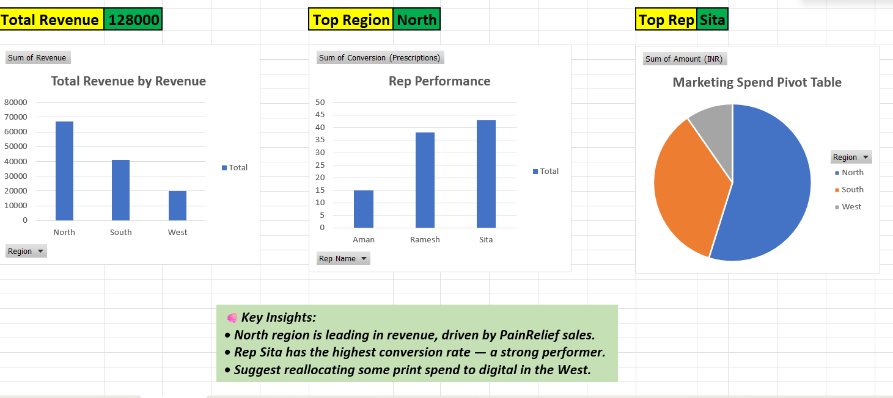

# Pharma Market Performance Analyzer 💊📊

An Excel-based dashboard to analyze regional sales, marketing spend, and rep performance in a pharma company. Built using pivot tables, KPIs, and charts to provide actionable business insights.

## 📁 Features
- Pivot analysis of revenue by product and region
- Sales rep conversion performance
- Marketing spend impact visualization (pie chart)
- KPIs and recommendations summary

## 📄 Tools Used
- Microsoft Excel
- Pivot Tables, Charts
- Basic formulas (SUM, INDEX-MATCH)

## 🔗 Screenshots
### 🔹 Dashboard Overview

## 📂 Project File

[⬇️ Download the Excel Dashboard](Pharma_Market_Analyzer.xlsx)  
Includes all pivot tables, KPI calculations, charts, and dashboard visuals.
